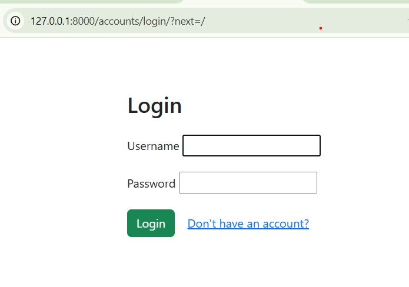
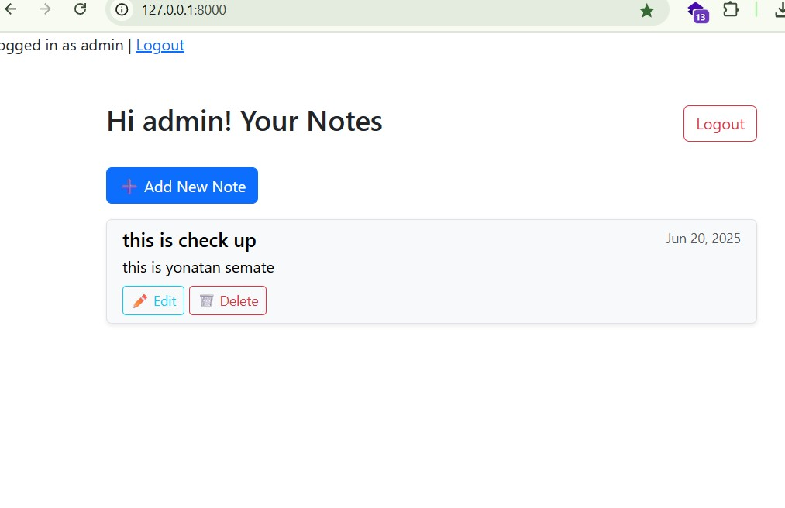
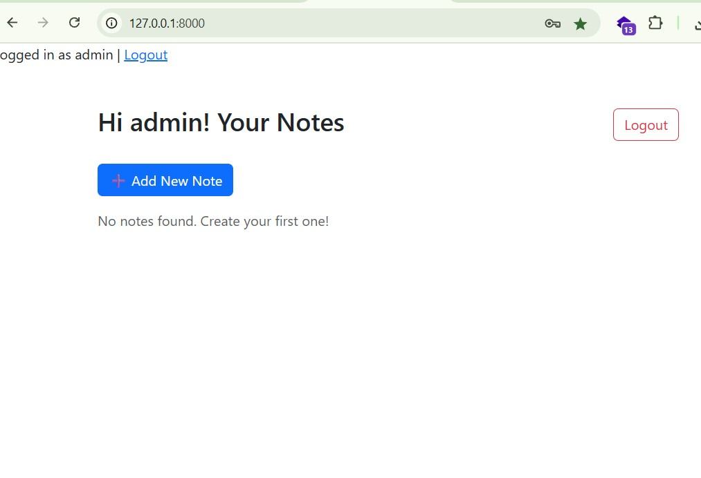
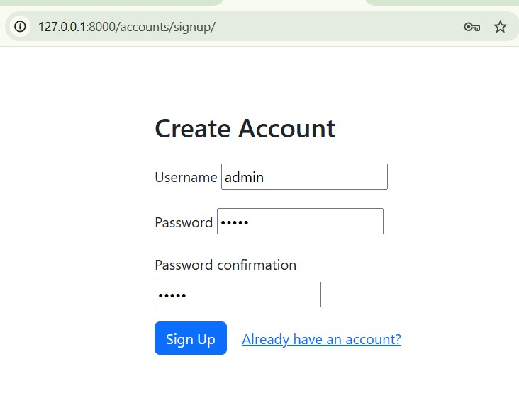
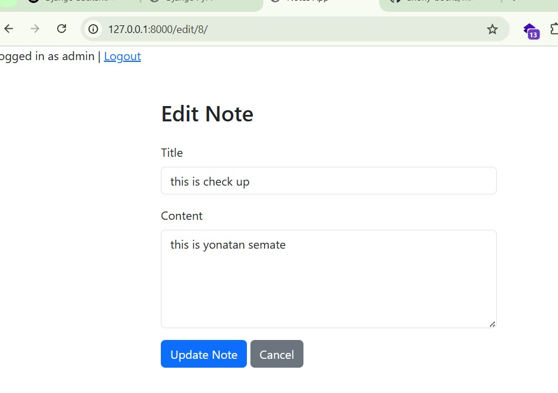
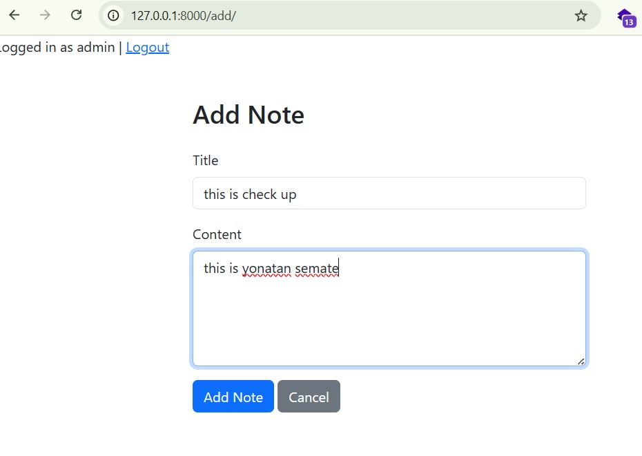

# 📝 Django Notes App

A simple Notes app built with Django that allows users to register, log in, and manage personal notes (create, read, update, delete).

---

## 🚀 Features

- 🔐 User registration & login
- 📝 Create, update, and delete notes
- 👤 Notes are private to each user
- 💻 Bootstrap-based clean and responsive UI

---
## Live Demo

Check out the live site here: [anony.pythonanywhere.com](https://anony.pythonanywhere.com/)

## 🛠️ Tech Stack

| Layer     | Technology     |
|-----------|----------------|
| Backend   | Python, Django |
| Frontend  | HTML, Bootstrap |
| Database  | SQLite (default in Django) |

---

## 📸 Screenshots

### 🔐 Login Page


### 🏠 Homepage (Logged-in Notes List)


### 🏁 First Time Homepage (Not Logged In)


### 📝 Register Page


### ✅ Register Success Page


### ✏️ Edit Note


### ➕ Add Note


---

## ⚙️ Setup Instructions

### 🔧 1. Clone the repository

```bash
git clone https://github.com/anony-bocha/notes_app.git
cd notes_app
